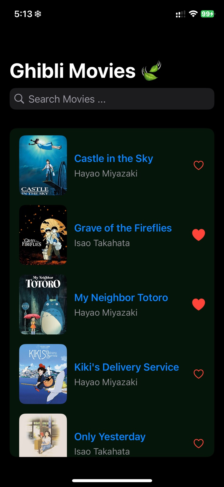
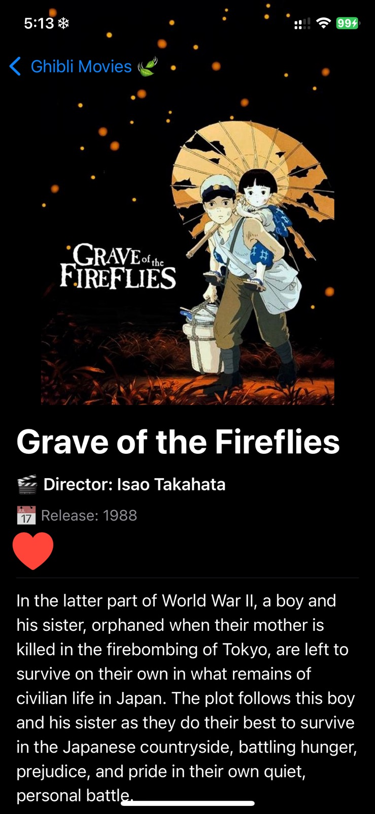

# 🌟 GhibliSwiftUI

**Discover Studio Ghibli movies on iOS!**  
A beautiful **SwiftUI app** with smooth animations, movie details, and easy browsing. Perfect for Ghibli fans and SwiftUI enthusiasts alike. 🎬✨

---

## 🚀 Features
- Browse **Studio Ghibli movies** with poster thumbnails.  
- Tap for **movie details**: description, director, release date.  
- **Smooth transitions & animations** (fade, scale, parallax).  
- **Search functionality** for quick access to your favorites.  
- Built with **MVVM architecture** & async API fetching.  
- Works on **iOS 16+**.

---

## 📸 Demo / Preview

<table>
  <tr>
    <td>
      
    </td>
    <td>
      
    </td>
  </tr>
</table>
---

## ⚡ Quick Start

```bash
git clone https://github.com/xiaoyuan31/GhibliSwiftUI.git
